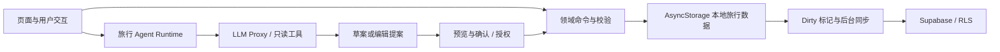

<a id="top"></a>

<div align="center">


# 一路记 · WayLog

**个人旅行控制台与旅行手账**

把旅行计划、每日安排、地点收藏和预算收进一个工作区，
让 AI 帮你提出建议，由你决定如何修改行程。

A local-first travel workspace with an AI copilot.

[](LICENSE)
[](https://reactnative.dev/)
[](https://expo.dev/)
[](https://www.typescriptlang.org/)
[](https://supabase.com/)

[功能概览](#功能概览) · [快速开始](#快速开始) · [架构设计](#架构设计) · [开发文档](#开发文档) · [参与贡献](CONTRIBUTING.md)

</div>

---

## 项目介绍

WayLog 面向个人旅行者，围绕一趟旅行组织信息：去哪、每天做什么、收藏了哪些地点、预算花在哪里、还有什么需要准备。

仓库包含 React Native / Expo 客户端、Next.js 管理后台、静态官网，以及 Supabase 数据库迁移和 Edge Functions。移动端体验优先，保留 Web 使用入口。

项目处于持续开发阶段，当前重点是旅行记录与同步的稳定性，以及 Agent 的草案、预览、确认和执行闭环。各模块的范围与状态见 [产品说明](docs/01-产品需求文档-PRD.md)。

## 功能概览

| 能力 | 使用场景 |
| :-- | :-- |
| **行程工作区** | 创建和管理旅行，按天组织安排、交通、住宿与重要备忘 |
| **地点管理** | 搜索与收藏 POI，查看地点详情，维护待安排地点和地图信息 |
| **预算与清单** | 记录多币种费用，管理行前准备与打包清单 |
| **旅行 Agent** | 生成行程草案，对已有行程提出添加、修改、移动或删除建议 |
| **旅行信息工具** | 按需查询地点、天气、路线与网页来源，辅助做出旅行决策 |
| **账号与同步** | 本地保存旅行数据，结合 Supabase 认证、云同步与同步状态反馈 |
| **管理后台** | 管理用户、POI、反馈、管理员和服务配置；部分运营模块仍在完善 |

Agent 输出草案或提案，客户端完成校验和影响预览后再进入应用流程。默认写入需要明确确认；快捷代办仅在用户开启后覆盖符合条件的低风险编辑。新建旅行保留独立的创建授权。

## 设计原则

- **本地优先**：旅行修改先写入 AsyncStorage，标记待同步，再由后台同步到云端。
- **用户掌控**：模型生成建议，领域命令执行已确认或已授权的修改；二者有明确边界。
- **稳定标识**：跨层使用 `tripId`、`dayId`、`itemId` 和版本信息，保持幂等与冲突检查。
- **清晰分层**：路由、页面、业务规则、共享 UI 和原生模块各自承担明确职责。

## 快速开始

当前验证环境使用 Node.js 26；包管理器版本由 `package.json` 固定为 `pnpm@11.7.0`。

```bash
git clone https://github.com/PraxisGrove/WayLog.git
cd WayLog
pnpm install
cp .env.example .env.local
```

在 `.env.local` 中填写你自己的配置。接入认证与同步时至少配置 Supabase 项目 URL 和客户端 anon / publishable key；地图、图片、微信和 Agent 服务按需要配置。完整变量说明见 [.env.example](.env.example) 和 [开发指南](docs/development.md)。

```bash
pnpm dev       # 启动 Expo
pnpm web       # Web 调试
pnpm android   # Android 调试
pnpm ios       # iOS 调试
```

PowerShell 中用 `Copy-Item .env.example .env.local` 复制配置。原生模块需要对应的开发构建及平台工具链；具体步骤见 [开发指南](docs/development.md)。

### 其他工作区

```bash
pnpm admin:dev                     # Next.js 管理后台
pnpm --filter @waylog/os-web dev    # 静态官网
```

后台和官网分别维护自己的说明：[Admin Web](admin-web/README.md) · [Official Site](os-web/README.md)。

### 常用检查

```bash
pnpm typecheck
pnpm test
pnpm lint
```

测试使用 Node.js `node:test`，覆盖领域命令、协议校验、本地存储、同步和 Agent 应用流程。管理后台有独立的类型与 lint 检查；验收范围见 [测试与发布](docs/05-测试与验收说明.md)。

## 架构设计



Agent 对话及执行记录由本地 SQLite 能力管理；Trip 写入仍走本地优先链路。详细合同见 [架构说明](docs/03-技术方案与架构.md) 与 [Agent Runtime](docs/agents/agent-runtime.md)。

```text
WayLog/
├── app/           Expo Router 路由入口
├── shell/         应用壳层、Provider 与全局生命周期
├── domains/       功能页面、交互编排与页面组件
├── features/      领域命令、协议、存储与同步
├── shared/        共享 UI、主题、Hook 与工具
├── modules/       Expo 原生模块
├── plugins/       Expo 配置插件
├── admin-web/     Next.js 管理后台
├── os-web/        静态官网
├── supabase/      数据库迁移、邮件模板与 Edge Functions
├── tests/         自动化测试
├── docs/          产品与开发文档、架构决策
└── licenses/      第三方许可证声明
```

| 工作区 | 主要技术 |
| :-- | :-- |
| 客户端 | React Native 0.81、React 19、Expo SDK 54、Expo Router、React Navigation |
| 本地能力 | AsyncStorage、SQLite、Reanimated、Expo 原生模块 |
| 管理后台 | Next.js 16、Ant Design、Refine、TanStack Query |
| 后端 | Supabase Auth、Postgres、RLS、Edge Functions |
| Agent | Pi Runtime、云端 RouteSelector、结构化提案、OpenAI-compatible 模型接口 |
| 工程工具 | TypeScript 5.9、pnpm workspace、Biome、Node.js `node:test` |

## 开发文档

| 文档 | 内容 |
| :-- | :-- |
| [文档导航](docs/README.md) | 按开发任务选择入口，区分当前合同与历史决策 |
| [开发指南](docs/development.md) | 环境配置、本地运行、工作区与部署准备 |
| [贡献指南](CONTRIBUTING.md) | Issue、Pull Request、编码约定与验证要求 |
| [产品说明](docs/01-产品需求文档-PRD.md) | 产品范围、当前状态与开发优先级 |
| [UI 与 UX](docs/02-UX与设计稿说明.md) | 默认皮肤、主题 token 与移动端体验 |
| [系统架构](docs/03-技术方案与架构.md) | 分层、依赖方向、数据流与 Agent 边界 |
| [数据与 API 契约](docs/04-数据模型与API契约.md) | 数据标识、兼容性、同步与确认合同 |
| [测试与发布](docs/05-测试与验收说明.md) | 回归范围、构建与发布检查 |
| [领域词汇](CONTEXT.md) | 产品语言与当前概念边界 |
| [Agent 执行规则](AGENTS.md) | coding agent 修改本仓库时的稳定约束 |

## 开发方向

| 优先级 | 当前重点 |
| :-- | :-- |
| P0 · 稳定性 | 认证、同步失败恢复、移动端体验和发布链路 |
| P1 · Agent | 真实地点核验、草案确认、编辑风险预览和幂等执行 |
| P2 · 体验完善 | 旅行上下文、usage 展示、页面组织和更多低风险编辑能力 |

旅行手账导出等后续方向以产品文档为准。社区、协作、自动预订及通用日历不属于当前核心交付范围。

## 安全与配置

`.env.local`、签名文件、日志和内部材料保留在本地。`EXPO_PUBLIC_*` 与 `NEXT_PUBLIC_*` 会进入客户端，服务端密钥使用非公开变量并部署到对应服务端环境。

Fork 或独立部署时，使用自己的 Supabase、Expo、Sentry 和第三方服务账号。安全问题请通过 [私密漏洞报告](https://github.com/PraxisGrove/WayLog/security/advisories/new) 提交，披露说明见 [SECURITY.md](SECURITY.md)。

## 参与贡献

欢迎提交可复现的问题、改进建议和 Pull Request。开始前阅读 [CONTRIBUTING.md](CONTRIBUTING.md)；涉及数据写入或 Agent 行为时，一并检查对应合同和回归用例。

[报告问题](https://github.com/PraxisGrove/WayLog/issues/new/choose) · [查看 Issues](https://github.com/PraxisGrove/WayLog/issues) · [提交 Pull Request](https://github.com/PraxisGrove/WayLog/pulls)

## 许可证与致谢

WayLog 的第一方代码、文档和品牌素材使用 [MIT 许可证](LICENSE)。第三方代码、依赖、字体和外部服务素材仍适用各自的许可；来源与分发边界见 [第三方声明](THIRD_PARTY_NOTICES.md)。

感谢 React Native、Expo、Supabase、Pi 及其他开源项目提供的基础能力。

<div align="center">

[回到顶部](#top)

</div>
